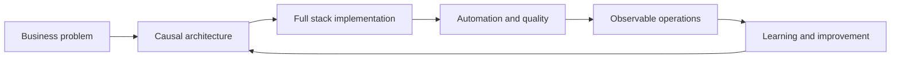

# Jesús Chávez Galaviz
**Technical Manager / Software Architect / Senior Full Stack Developer**

  
Architecture + delivery + automation

  

    I build and stabilize systems where business, operations, and technology meet:
    full stack platforms, enterprise integrations, AI-enabled automation, observability,
    data workflows, and algorithmic trading. My edge is moving fluently between strategy,
    architecture, and executable senior-level code.
  

  

    15+ years IT
    Hands-on senior
    Python / Java / JS
    Fintech / ERP / Quant
  

## Value Proposition

  

    <h3>Architecture That Ships</h3>
    
Technical direction with business judgment, controlled debt, and realistic delivery paths.

  

  

    <h3>Useful Automation</h3>
    
Scripts, bots, integrations, and AI workflows that remove operational friction.

  

  

    <h3>Technical Leadership</h3>
    
Team direction, mentoring, DevOps governance, and clear stakeholder communication.

  

## Quick Signals

  
<strong>Full stack</strong>
Backend, frontend, mobile, integrations, and cloud.

  
<strong>Enterprise</strong>
Finance, ERP, fiscal billing, retail, and global support.

  
<strong>Quant</strong>
Models, backtesting, MQL5, PineScript, Optuna, and automation.

  
<strong>Teaching</strong>
More than two decades teaching science, technology, and languages.

## Executive Map

## Recommended Reading

* [Professional summary](resumen.md)
* [Selected achievements](logros.md)
* [Technical skills](habilidades.md)
* [Experience: Algotrading & Quant](exp/algotrading.md)
* [Consolidated template](plantilla_consolidada.md)
