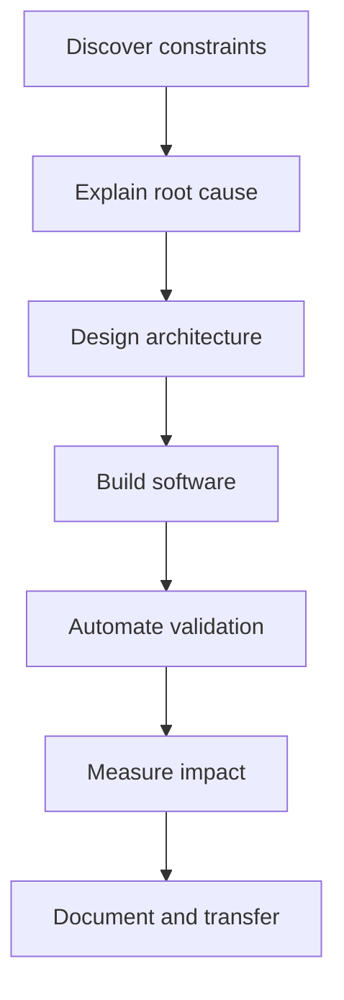

# Professional Summary

I am a technical leader, software architect, and polyglot Senior Full Stack developer with experience as an entrepreneur, consultant, and freelancer. I have worked as both leader and developer across projects of different sizes using **Node.js, Python, Java, PHP, React, and Vue**, combining business vision, clean architecture, and hands-on senior execution.

My trajectory includes **Algotrading and Quantitative Development** since 2019, enterprise integrations, technical automation, observability, cloud, and team leadership in global corporate environments.

## Operating Model

## Impact Domains

* **Architecture and delivery:** maintainable systems, technical roadmaps, debt reduction, and business alignment.
* **Senior development:** daily implementation across backend, frontend, mobile, data, integrations, APIs, and automation.
* **Operations and quality:** CI/CD, observability, testing, log analysis, dashboards, and incident response.
* **Automation and AI:** bots, scraping, code analysis, documentation generation, and LLM-based accelerators.
* **Leadership:** mentoring, recruiting, technical management, stakeholder negotiation, and team enablement.

## Distinctive Profile

My profile combines three layers that rarely appear together: executive judgment, technical depth, and teaching ability. That lets me translate ambiguous needs into architecture, code, process, and transferable knowledge.
