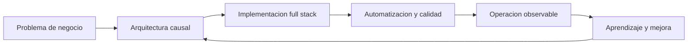

# Jesús Chávez Galaviz
**Gerente Técnico / Arquitecto de Software / Desarrollador Full Stack Senior**

  
Arquitectura + delivery + automatización

  

    Construyo y estabilizo sistemas donde conviven negocio, operación y tecnología:
    plataformas full stack, integraciones enterprise, automatización con IA, observabilidad,
    datos y trading algorítmico. Mi ventaja está en moverme con solvencia entre estrategia,
    arquitectura y código ejecutable.
  

  

    15+ años IT
    Hands-on senior
    Python / Java / JS
    Fintech / ERP / Quant
  

## Propuesta de valor

  

    <h3>Arquitectura que aterriza</h3>
    
Definición técnica con criterio de negocio, deuda controlada y rutas de entrega realistas.

  

  

    <h3>Automatización útil</h3>
    
Scripts, bots, integraciones y flujos IA para reducir fricción operativa y acelerar equipos.

  

  

    <h3>Liderazgo técnico</h3>
    
Dirección de equipos, mentoring, gobernanza DevOps y comunicación clara con stakeholders.

  

## Señales rápidas

  
<strong>Full stack</strong>
Backend, frontend, móvil, integraciones y cloud.

  
<strong>Enterprise</strong>
Finanzas, ERP, facturación fiscal, retail y soporte global.

  
<strong>Quant</strong>
Modelos, backtesting, MQL5, PineScript, Optuna y automatización.

  
<strong>Docencia</strong>
Más de dos décadas enseñando ciencias, tecnología e idiomas.

## Mapa ejecutivo

## Lectura recomendada

* [Resumen profesional](resumen.md)
* [Logros seleccionados](logros.md)
* [Habilidades técnicas](habilidades.md)
* [Experiencia: Algotrading & Quant](exp/algotrading.md)
* [Plantilla consolidada](plantilla_consolidada.md)
