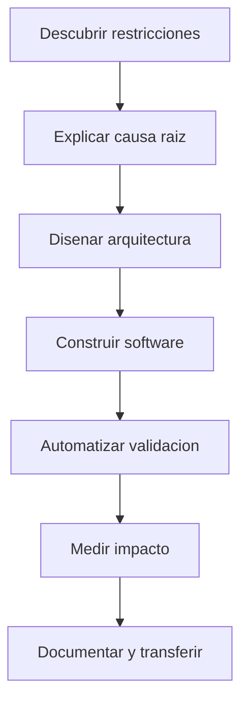

# Resumen Profesional

Soy un líder técnico, arquitecto de software y desarrollador Senior políglota Fullstack con experiencia como emprendedor, consultor y freelancer. He participado como líder y desarrollador en proyectos de distintas escalas usando **Node.js, Python, Java, PHP, React y Vue**, combinando visión de negocio, arquitectura limpia y ejecución hands-on.

Mi trayectoria incluye **Algotrading y Desarrollo Cuantitativo** desde 2019, integraciones enterprise, automatización técnica, observabilidad, cloud y dirección de equipos en entornos corporativos globales.

## Modelo operativo

## Dominios de impacto

* **Arquitectura y delivery:** diseño de sistemas mantenibles, definición de roadmaps técnicos, reducción de deuda y alineación con negocio.
* **Desarrollo senior:** implementación diaria en backend, frontend, mobile, datos, integraciones, APIs y automatización.
* **Operación y calidad:** CI/CD, observabilidad, pruebas, análisis de logs, dashboards y respuesta a incidentes.
* **Automatización e IA:** bots, scraping, análisis de código, generación de documentación y aceleradores con LLMs.
* **Liderazgo:** mentoring, reclutamiento, gestión técnica, negociación con stakeholders y formación de equipos.

## Perfil distintivo

Mi perfil combina tres capas que rara vez aparecen juntas: criterio directivo, profundidad técnica y capacidad docente. Eso me permite traducir necesidades ambiguas en arquitectura, código, procesos y conocimiento transferible.
